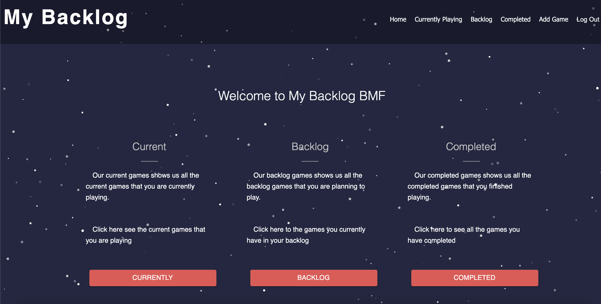
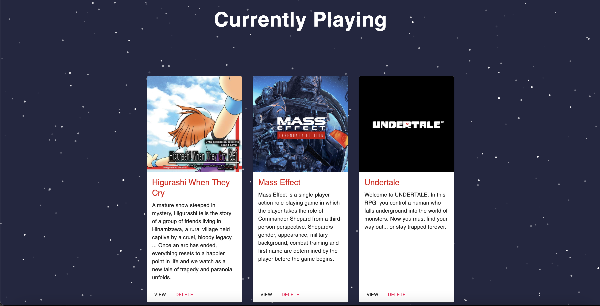
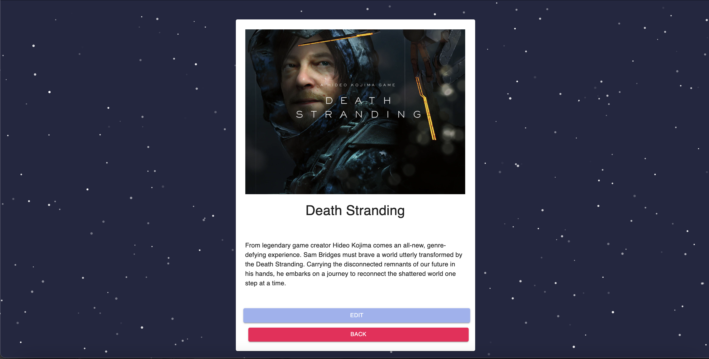
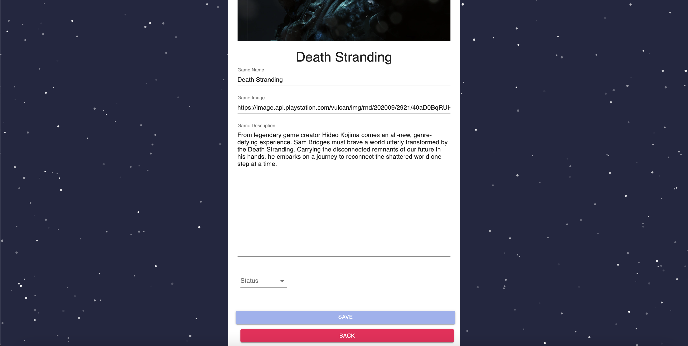
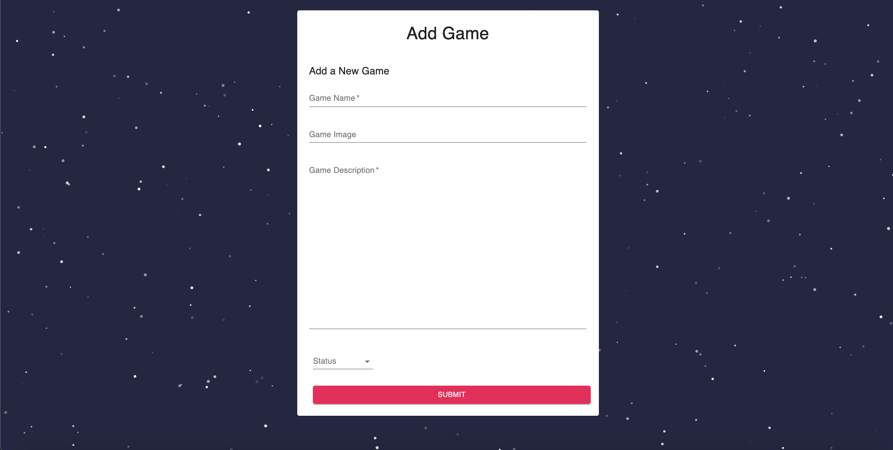

# My Backlog

## Description

_Duration: 2 Week Sprint_

MyBacklog is a responsive web application. The design is meant for desktop only. This application allows the user to
keep a backlog of games. There are three different sections to keep games, the three different sections are Currently playing, Backlog, and Completed. The user can edit or delete any game on each list. Deleting the game will delete the game from the database and the edit will allow the user to edit the game name, details, image, and status of the game. There is an add feature that allows the user to add a new game. 

To see the fully functional site, please visit: [DEPLOYED VERSION OF APP](https://sheltered-basin-25670.herokuapp.com/#/home)

## Screen Shot

### Prerequisites

Link to software that is required to install the app (e.g. node).

- [Node.js](https://nodejs.org/en/)
- [Postgres](https://www.postgresql.org/download/)

## Installation

1. Create a database named `prime-app`,
2. The queries in the `database.sql` file are set up to create all the necessary tables and populate the needed data to allow the application to run correctly. The project is built on [Postgres](https://www.postgresql.org/download/), so you will need to make sure to have that installed. We recommend using Postico to run those queries as that was used to create the queries,
3. Add a .env file for `SERVER_SESSION_SECRET` with a random string for security
3. Open up your editor of choice and run an `npm install`
4. For react-particles-js run `react-particles-js --legacy-peer-deps` or it will not work
5. Run `npm run server` in your terminal
6. Run `npm run client` in your terminal
7. The `npm run client` command will open up a new browser tab for you!

## Usage
How does someone use this application? Tell a user story here.

1. The user will come to the landing page, the user can either signin or create a new account
2. When the user has logged in it will take you to the home page where you can select a button to view the different catalogs
3. Viewing currently playing, backlog, or completed will show the users games in a list where the user can either edit or delete 
4. When you edit it takes you to a new page where the user can edit the information and it allows the user to change the status of the game. This will send it to a new page if changing the status.
5. The add games page allows the user to add a new game, image, description, and status of the game.

## Built With

- Redux
- React
- Router-dom
- Redux Saga
- Material UI
- Bcrypt
- React-particles-js
- Sass
- Express

## License
[MIT](https://choosealicense.com/licenses/mit/)

## Acknowledgement
Thanks to [Prime Digital Academy](www.primeacademy.io) who equipped and helped me to make this application a reality. 

Special thanks to Mary, She is a wonderful person and helped give me the knowledge to build this project!

## Support
If you have suggestions or issues, please email me at [Johnny.Keple@gmail.com](Johnny.Keple@gmail.com)
